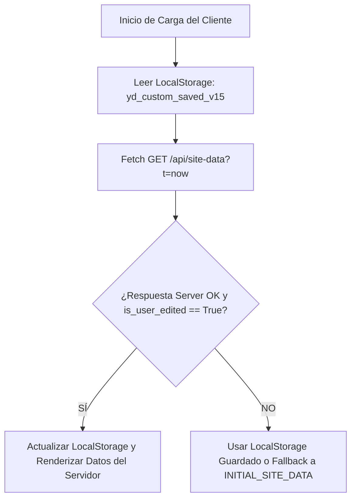

# 🛠️ MANUAL TÉCNICO Y DE ARQUITECTURA - YD PROTECCIÓN WEB PLATFORM

**Versión del Sistema:** 15.0.0  
**Backend Framework:** FastAPI 0.100+ (Python 3.10 / 3.11)  
**Frontend Stack:** Single Page Application (SPA) Vanilla HTML5, CSS3, ES6+, Jinja2 Templates  
**Entorno de Ejecución:** Vercel Serverless Function Engine  
**Repositorio GitHub:** [https://github.com/Yada12131/proyectoYD.git](https://github.com/Yada12131/proyectoYD.git)  
**Rama Principal:** `main`

---

## 📋 TABLA DE CONTENIDOS
1. [Resumen de Arquitectura del Sistema](#1-resumen-de-arquitectura-del-sistema)
2. [Estructura del Proyecto](#2-estructura-del-proyecto)
3. [Especificaciones del Backend (FastAPI)](#3-especificaciones-del-backend-fastapi)
4. [Motor de Persistencia y Sincronización (v15.0)](#4-motor-de-persistencia-y-sincronización-v150)
5. [Frontend & Design System CSS](#5-frontend--design-system-css)
6. [Configuración de Despliegue en Vercel](#6-configuración-de-despliegue-en-vercel)
7. [Guía de Mantenimiento y Extensión de Código](#7-guía-de-mantenimiento-y-extensión-de-código)

---

## 1. RESUMEN DE ARQUITECTURA DEL SISTEMA

La plataforma **YD Protección** está construida bajo una arquitectura híbrida Serverless SPA:

- **Monolito Serverless en `api/index.py`:** Integra en un solo archivo Python de alto rendimiento el motor de rutas FastAPI, el motor de plantillas Jinja2 para la inyección inicial de CSS/HTML/JS y las API REST Endpoints para la lectura y escritura de configuraciones.
- **Cliente SPA Reactivo en JavaScript Vanilla:** Toda la renderización de vistas, filtrado de categorías, apertura de modales, preloader animado, notificaciones Toast y formularios del CMS operan en el lado del cliente (Client-Side Rendering) sin recargas de página.
- **Doble Capa de Persistencia:** Garantiza resiliencia frente a los arranques en frío (*cold starts*) de Vercel mediante `localStorage` prioritario (`yd_custom_saved_v15`) y almacenamiento efímero sincronizado en el servidor (`/tmp/yd_site_config_v15.json`).

---

## 2. ESTRUCTURA DEL PROYECTO

```
catalogo/
├── api/
│   └── index.py            # Código fuente principal (FastAPI, HTML, CSS, JS Engine & API Endpoints)
├── docs/
│   ├── MANUAL_DE_USUARIO.md # Manual funcional para administradores y usuarios
│   ├── MANUAL_TECNICO.md    # Manual técnico de arquitectura y desarrollo (este archivo)
│   └── README.md            # Índice de documentación
├── vercel.json              # Configuración de ruteo Serverless para Vercel Deployment
└── README.md                # Presentación general del proyecto en GitHub
```

---

## 3. ESPECIFICACIONES DEL BACKEND (FASTAPI)

El archivo `api/index.py` exporta la instancia de aplicación `app` y el manejador `handler` requerido por la infraestructura Serverless de Vercel.

### Endpoints REST de la API:

1. **`GET /api/site-data`**
   - **Propósito:** Retorna la estructura JSON completa de configuración del sitio guardada en memoria / servidor.
   - **Cache Buster:** Soporta parámetro de query `?t=timestamp` para prevenir almacenamiento en caché agresivo de navegadores móviles.
   - **Respuesta:** Objeto JSON con el esquema `INITIAL_SITE_DATA` actualizado.

2. **`POST /api/site-data`**
   - **Propósito:** Recibe las actualizaciones enviadas desde el Panel Admin CMS.
   - **Validación:** Comprueba la existencia del array `nav_links`.
   - **Persistencia:** Asigna la bandera `is_user_edited = True`, actualiza el estado global en memoria `SAVED_CLOUD_SITE_DATA` y escribe en el sistema de archivos efímero `/tmp/yd_site_config_v15.json`.

3. **`GET /` & Ruteo Catch-All (`/{full_path:path}`)**
   - **Propósito:** Sirve la plantilla Jinja2 renderizada `INDEX_HTML` para cualquier ruta amigable del navegador (`/home`, `/quienes-somos`, `/categorias`, `/tienda`, `/servicios`, `/contacto`, `/admin`, `/dashboard`).

---

## 4. MOTOR DE PERSISTENCIA Y SINCRONIZACIÓN (v15.0)

Para solucionar la naturaleza efímera de las funciones Serverless en Vercel, el motor de sincronización sigue la siguiente jerarquía de prioridad en el cliente JavaScript (`getSiteData()`):



### Algoritmo de Guardado (`saveSiteData(data)`):
1. Inyecta `data.is_user_edited = true`.
2. Guarda inmediatamente en `localStorage` con la clave `yd_custom_saved_v15`.
3. Ejecuta `renderSite(data)` para actualizar el DOM del usuario de forma instantánea sin parpadeos.
4. Envía una petición `POST` asíncrona a `/api/site-data` para actualizar el estado en la nube Supabase / Serverless.

---

## 5. FRONTEND & DESIGN SYSTEM CSS

El diseño visual está construido con CSS nativo optimizado con las siguientes variables globales (`:root`):

```css
:root {
    --navy: #0B1C30;
    --navy-dark: #050E1A;
    --orange: #FF6600;
    --orange-light: #FF8533;
    --orange-hover: #E65C00;
    --white: #FFFFFF;
    --light-bg: #F8FAFC;
    --text-dark: #0F172A;
    --text-muted: #64748B;
    --card-shadow: 0 10px 30px -5px rgba(0, 0, 0, 0.05);
    --hover-shadow: 0 20px 40px -5px rgba(255, 102, 0, 0.22);
}
```

### Características Clave del UI Engine:
- **Responsive Fluid Design:** Breakpoints en `@media (max-width: 860px)` y `@media (max-width: 600px)`.
- **Sticky Admin Action Bar (`.sticky-admin-save-bar`):** Elemento fijo con `backdrop-filter: blur(16px)` y animación `barSlideUp`.
- **Input Icon Group (`.input-icon-wrapper`):** Disposición flexbox que integra una caja de ícono fija con la caja de entrada de texto.

---

## 6. CONFIGURACIÓN DE DESPLIEGUE EN VERCEL

El archivo `vercel.json` en la raíz del proyecto redirige todas las peticiones al punto de entrada WSGI/ASGI `api/index.py`:

```json
{
  "builds": [
    {
      "src": "api/index.py",
      "use": "@vercel/python"
    }
  ],
  "routes": [
    {
      "src": "/(.*)",
      "dest": "api/index.py"
    }
  ]
}
```

---

## 7. GUÍA DE MANTENIMIENTO Y EXTENSIÓN DE CÓDIGO

### Adición de Nuevos Campos en la Estructura de Datos:
1. Agrega el nuevo campo o propiedad dentro de `INITIAL_SITE_DATA` en `api/index.py`.
2. Actualiza la función JavaScript `renderSite(data)` para inyectar el valor en el elemento HTML deseado.
3. Agrega la caja de entrada correspondiente en la pestaña del CMS en `#page-admin` dentro de `INDEX_HTML`.
4. Mapea la lectura y escritura del nuevo campo dentro de las funciones de guardado (`saveHomeParams`, `saveCompanyParams`, etc.).
